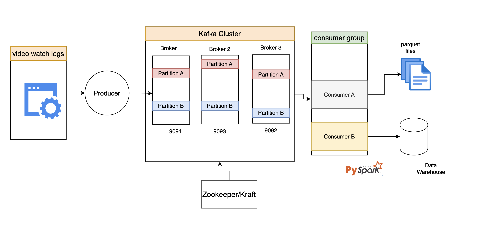

## Solution to the Assessment

### QUESTION 1

---

### QUESTION 2: Cloud Platform Decision

Consider that you're setting up a data lake for Miva and you have to choose between AWS, GCP, or Azure.  
Which of the cloud platforms would you use? Justify your choice based on cost, scalability, and available services.

#### ANSWER

Based on available services, it is customary for me to best assess the ecosystem (AWS, GCP or Azure) in which Miva uses currently. This is to avoid inter-regional, inter-cloud transfer costs, cloud setup overhead, etc. while passing the data around the pipeline.

However, my preferred solution is GCS, for the following reasons:

1. **Low latency and High throughput** for the video logs and videos themselves. Based on the specified storage tier, GCS offers high throughput and supports parallel uploads and downloads, allowing for efficient data transfer. Reading and writing data too frequently could incur higher costs on AWS S3 especially when data transfers are out of one’s region.

2. **GCS supports the Open Table format**: In case the architecture that would be needed to be set up would be Open Table Iceberg which supports rapidly changing data. GCS leverages on the cost-efficient high throughput to make this possible.  
   [GCS Open table format documentation](https://cloud.google.com/bigquery/docs/query-open-table-format-using-manifest-files)

3. **Scalability**: GCS is built for scalability. It automatically handles the underlying infrastructure and provides high durability by replicating data across multiple geographically diverse locations. Interestingly, you can specify how frequently you want to access that data which will ultimately determine your cost.

> As for Azure, it works perfectly with an all Azure ecosystem. This highly saves cost of various services they offer. However, workers with a non-Microsoft operating system might suffer some discomfort using the service as the applications are not optimized to run on other than a Windows Operating system.

---

### QUESTION 3: Data Transformation

Write a Python or SQL script to:

- records for role = 'Student'  
  **ANSWER**:  
  Query can be accessed here:  
  [student_data.sql](https://github.com/Jafar-design/data_loading_with_miva/blob/master/dbt/models/staging/student_data.sql)

- Summarize the dataset by:

  - **Learner with the most watched videos (Rank by completion rate)**  
    **ANSWER**:  
    Query can be accessed here:  
    [learner_highest_completion_rate_q1.sql](https://github.com/Jafar-design/data_loading_with_miva/blob/master/dbt/models/mart/learner_highest_completion_rate_q1.sql)

  - **Average completion rate per student (List Top 10 and Last 10 Engaged learners)**  
    **ANSWER**:  
    [ranked_students_top_and_bottom_10_q2.sql](https://github.com/Jafar-design/data_loading_with_miva/blob/master/dbt/models/mart/ranked_students_top_and_bottom_10_q2.sql)

  - **Average completion rate per course (List the most and least engaged videos for each course)**  
    **ANSWER**:  
    [ranked_videos_top_and_bottom_10_q3.sql](https://github.com/Jafar-design/data_loading_with_miva/blob/master/dbt/models/mart/ranked_videos_top_and_bottom_10_q3.sql)

---

### QUESTION 4: Data Processing Setup (Design)

Describe how you would design a real-time pipeline to process video watch logs.  
What type of data would you implement real-time and batch data processing on and what are the reasons for your decisions?

**Proposed architecture:**



**Watch events (play, pause, seek)**

#### ANSWER

- **Data Ingestion Layer**  
  Source Ingestion: Video player/app sends events (e.g., play, pause, seek, complete) as logs.  
  Tool: Apache Kafka, Kafka topic partitioned by `user_id` or `video_id` for scalability.

- **Data Transformation Layer**  
  To transform the logs into desirable schema  
  Preferred tool: Spark for streaming

- **Storage Layer**  
  To store the data in databases or open tables  
  Preferred format: Parquet file for open tables like Iceberg, and BigQuery for warehousing

- **Comments**  
  Video streaming logs data are mostly JSON or Apache styled logs. Because these data come in real-time, they tend to grow very large.  
  I choose to store them in Parquet format, partitioned by day and in a partitioned BigQuery table, where I define an expiry of 90 days.

---

### QUESTION 5: Data Quality Checks

How would you:
- Handle missing record like `video_id`, `completion_rate`, or `student_id`
- Log and report any anomalies

#### ANSWER

Using the dataset above, I handled missing records by writing `dbt tests` testing for `not_null` using the `schema.yml` file in my staging dataset.

For detecting anomalies, I use `dbt_expectations`:

```yml
- dbt_expectations.expect_column_values_to_be_between:
    min_value: 0
    max_value: 1
    strictly: true
```

I would also have customized alerts to Slack channels in case we have failed models.

---

### QUESTION 6: Partitioning Strategy

**Prompt:**  
Given a large table of video interactions:  
How would you partition the table using an optimal strategy for better query performance?

#### ANSWER

If the dataset contains granular data with a `date` field, I will partition by `date`.  
Alternatively, if most aggregations (GROUP BYs) are done on `student_id`, then `student_id` can be used.

**Justification:**

1. Partitioning allows BigQuery to avoid scanning the entire table when querying recent data.
2. Querying recent data is common; no need to scan the full table. Date partitioning greatly speeds up queries.

**How does this strategy reduce data cost?**

1. Minimizes shuffling. Querying and ordering recent data reduces memory-intensive operations.
2. Enables efficient data management. Partitioning can limit the table to the last 90 days. Cloud warehouses like BigQuery charge based on storage usage.

---

### QUESTION 7: Incremental Pipeline Script

How would you implement a Python/SQL-based incremental load:  
Only insert/update records and avoid reprocessing already loaded data.

#### ANSWER

1. Use `dbt` with materialization set to `incremental`:

```jinja
{{ config(
    materialized='incremental',
    unique_key='id'
) }}
```

2. Use `is_incremental()` with a timestamp check:

```jinja

WHERE last_updated_at > (SELECT MAX(last_updated_at) FROM {{ this }})

```

3. For upserts, specify a unique `id` column, especially if using CDC:

```jinja
{{ config(
    materialized='incremental',
    unique_key='id'
) }}
```

---

### QUESTION 8: Optimization Task

**Prompt:**  
Given the slow SQL query below calculating average completion rate per video, rewrite and optimize it using best practices.

```sql
SELECT video_id, AVG(completion_percentage) AS avg_completion_rate
FROM video_completions
GROUP BY video_id
ORDER BY avg_completion_rate DESC;
```

#### ANSWER

- Ensure `video_id` is indexed
- Exclude `NULL` values from `completion_percentage`
- Use a CTE for clarity and performance (for smaller tables)

Optimized query:

```sql
WITH valid_completions AS (
    SELECT video_id, completion_percentage
    FROM video_completions
    WHERE completion_percentage IS NOT NULL
)

SELECT video_id,
       ROUND(AVG(completion_percentage), 2) AS avg_completion_rate
FROM valid_completions
GROUP BY video_id
ORDER BY avg_completion_rate DESC;
```

---

### QUESTION 9: Secure Data Access

**Prompt:**  
Describe how you would implement:

- **Row-level access control:**  
  In BigQuery, this can be done by creating a row access policy and granting that policy to users or groups.  
  In open-source systems, this can be done via views that filter data based on user privileges.

- **Masking of PIIs (Personal Identifiable Information):**  
  In BigQuery, this can be done via **policy tags** to obfuscate sensitive columns.

---

### QUESTION 10: Secure Data Access

**Prompt:**  
Describe how you would implement data governance and metadata tracking at Miva, ensuring privacy compliance and ease of use for data consumers.

**Include thoughts on:**

- Metadata tracking
- Access control
- GDPR compliance
- Data cataloging

---

## Setup Instructions

### 1. Run this command to get started

```sh
docker compose up --build
```

More details about the project can be found in the GitHub repository.
